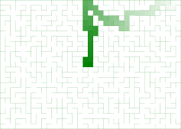

# Maze Builder

Build and download mazes interactively or using the command-line interface (CLI).
Rapidly prototype the design process with just an algorithm, width, length, and height.
Export the maze straight to a Wavefront object or PNG file.
Exports can then be integrated into game engines and renderers like Unity, Godot, Blender and so forth.



## Commands and Help Message

```sh
Usages: maze_builder.exe [OPTION(S)]... [OUTPUT]
Generates and exports mazes to string format or Wavefront object format
Example: maze_builder.exe -w 10 -l 10 -a binary_tree > out_maze.txt
  -a, --algorithm    binary_tree [default], sidewinder
  -s, --seed         seed for the random number generator [mt19937]
  -w, --width        maze width [default=100]
  -y, --height       maze height [default=10]
  -l, --length       maze length [default=100]
  -i, --interactive  run program in interactive mode with a GUI
  -o, --output       stdout [default], plain text [.txt], PNG [.png], or Wavefront [.obj]
  -h, --help         display this help message
  -v, --version      display program version
```

Specify a seed with the `binary__tree` maze-generating algorithm:
```sh
maze_builder.exe --seed=1337 --algorithm=binary_tree -o bt.obj
```

Run Maze Builder in an `interactive` mode:
```sh
maze_builder.exe -i
```

## CMake

This project uses `cmake` to as the build and test system. It uses `find_package` and `FetchContent` to get SDL and Catch2 if necessary.
It requires modern hardware supporting pthreads and OpenGL 3.0. The SDL library is used for portability and providing a window to draw on, and Catch2 is used for the tests.

Navigate to the repo, where `${my/mazebuilder/repo}` is the directory containg the Git repo for Maze Builder.


| CMake Option | Default | Description |
|--------------|---------|-------------
| BUILD_MAZE_TESTS | OFF | Build with maze algorithm testing via Catch2. |
| CMAKE_TOOLCHAIN_FILE | `cmake` | Building with a specific toolchain. Useful for Emscripten builds. |
| CMAKE_BUILD_TYPE | RelWithDebInfo | The build type is case-sensitive. It can determine compiler optimizations and performance. `MinSizeRel, Release, RelWithDebInfo, Debug`. |

```sh
cmake -S . -B build -DCMAKE_BUILD_TYPE=RelWithDebInfo -DBUILD_MAZE_TESTS=1 && cmake --build build/ -j 4 && cd build && ctest --verbose
```

Additionally, the Maze Builder can be built for the web using [Emscripten](https://emscripten.org/) and the toolchain file:

```sh
cmake -S . -B . -DCMAKE_TOOLCHAIN_FILE=${my/emsdk/repo}/upstream/emscripten/cmake/Modules/Platform/Emscripten.cmake 
```

Where `${my/emsdk/repo}` is the directory containing the Git repo for Emscripten.

## Scripts

There is a Ruby script `ruby mazes.rb` and a Python script `python3 solver.py` to play with
maze generation and finding paths. It is expected to generate PNG files using the Ruby script first,
and then find paths using the Python script to load the PNG files and find paths.

**Dependenceis**
  - `gem install chunky_png`
  - `pip install numpy pillow networkx`

## Web application

[Check out the web app!](https://jade-semifreddo-f24ef0.netlify.app/)

In order to run the web app locally, first run a local server with the provided [secure_http_server.py](secure_http_server.py) file, and then open the browser.

## Resources
 - [Mazes for Programmers Book](https://www.jamisbuck.org/mazes/)
 - [Full Stack Dev Book](https://www.packtpub.com/en-us/product/full-stack-development-with-spring-boot-and-react-9781801816786)
 - [Craft](https://github.com/fogleman/Craft)
 - [Dear ImGui](https://github.com/ocornut/imgui)
 - [SDL](https://github.com/libsdl-org/SDL)
 - [Catch2](https://github.com/catchorg/Catch2)
 - [Emscripten](https://emscripten.org/)
 - [stb](https://github.com/nothings/stb)
  