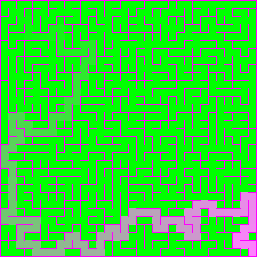

# Maze Builder

Create and customize mazes on multiple platforms and languages. An example output string is shown here:

```text
+-----+-----+-----+-----+-----+-----+-----+-----+-----+-----+
|                 |                       |                 |
+-----+-----+     +     +-----+-----+     +     +     +     +
|                 |                 |     |     |     |     |
+     +-----+-----+     +-----+-----+     +     +     +-----+
|     |           |     |           |           |           |
+     +     +     +     +     +     +-----+     +-----+     +
|     |     |           |     |           |           |     |
+     +     +-----+-----+     +-----+     +-----+-----+     +
|           |           |     |           |                 |
+     +-----+     +     +-----+     +-----+     +-----+-----+
|     |           |           |     |                       |
+     +-----+-----+-----+     +     +-----+-----+-----+     +
|                       |     |     |                       |
+-----+-----+-----+     +     +     +     +-----+-----+     +
|                 |     |     |     |           |           |
+-----+-----+     +     +     +     +     +     +     +-----+
|                 |     |     |     |     |     |     |     |
+     +-----+-----+     +     +     +-----+     +     +     +
|                             |                 |           |
+-----+-----+-----+-----+-----+-----+-----+-----+-----+-----+
```

## Data Formats

The library provides support for different export formats like Wavefront object format, JSON, and plain text or stdout.

There is an included example for parsing command-line arguments and creating JSON output:

`mazebuildercli.exe -r 2 -c 5 -o 2x5.json`

```json
{
  "rows": 2,
  "columns": 5,
  "seed": 2,
  "algo": "dfs",
  "output": "+---+---+---+---+---+\n
             |           |       |\n
             +   +---+   +---+   +\n
             |       |           |\n
             +---+---+---+---+---+\n"
}
```

---

# Examples

## Command-Line Interface (CLI)

This example lets you build mazes with all the functionality of the computer terminal.

Run the `binary_tree` algorithm with long arguments and make a Wavefront object maze:

```sh
mazebuildercli.exe --rows=25 --columns=25 --seed=42 --algo=binary_tree --output=bt.obj
```

Run the `dfs` algorithm with short arguments:

```sh
mazebuildercli.exe -r 25 -c 25 -s 42 -a dfs -o dfs.obj
```

Get some help and print to standard output:
```sh
mazebuildercli.exe --help
```

**Commands are case-sensitive!**

## C++ API 

Interface with the C++ API in a modern C++ program:

```cpp
#include <iostream>
#include <string>
    
// Get all the headers from Maze Builder
#include <MazeBuilder/maze_builder.h>

int main() {
  
  auto rows{10}, cols{10};

  auto maze_str = mazes::create(rows, cols);

  std::cout << mazes::string_utils::format("output: {}\n", maze_str);

  return 0;
}
```

---

## Voxels


  - The Voxels app is set in a 3D voxel world and enables interactive maze generation and downloading of Wavefront object files.

[Check out the this example in a live app!](https://jade-semifreddo-f24ef0.netlify.app/)

The web app can be run locally with the provided [secure_http_server.py](scripts/secure_http_server.py) script.
Once the script is running, open the browser to `http://localhost:8000`.

## HTTP Network

  - User can connect with [Corners](https://github.com/zmertens/Corners), the maze building service, to create mazes

## Physics

  - Simple scoring system that includes maintaining a string of highlighted bricks
  - Balls interact with the bricks and break them after repeated bounces
  - Updated event handling (mouse, touch, keyboard)
  - Maintains high scores via a network connection with [Corners](https://github.com/zmertens/Corners) or locally on harddrive
  - Spatialized sound effects in 2D

---

## CMake Configuration and Testing

[CMake](https://cmake.org) is used for project configuration.

Here are the external dependencies which can be grabbed from the Internet by CMake:

  - [box2d](https://box2d.org/documentation/hello.html)
  - [catch2](https://github.com/catchorg/Catch2)
  - [fmt](https://fmt.dev/latest/index.html)
  - [SDL](https://libsdl.org)
  - [SFML](https://sfml-dev.org)

Use the following CMake options to configure the project:

| CMake Option | Default | Description |
|--------------|---------|------------ |
| MAZE_BUILDER_EXAMPLES | OFF | Build with project examples enabled |
| MAZE_BUILDER_COVERAGE | OFF | Build with code coverage using `CppCheck` |
| MAZE_BUILDER_TESTS | OFF | Build with testing using `Catch2` |
| MAZE_BUILDER_DOCS | OFF | Build the docs using `doxygen` |
| MAZE_BUILDER_MEMCHECK | OFF | Build with `Valgrind` and `Memcheck` support |

---

### Build Commands

Configure it with [Ninja](https://ninja-build.org/) generator: `cmake -G"Ninja Multi-Config" -S . -B build-examples -DMAZE_BUILDER_EXAMPLES:BOOL=ON`

Build it: `cmake --build build-examples --config Release`

By default, both a shared-object library and static library are produced.
The shared and static files have different naming conventions depending on the platform:

| Platform | static lib | shared lib |
| -------- | ---- | ---- |
| Windows | `mazebuildercore_static.lib` | `mazebuildercore_shared.dll` |
| Linux | `libmazebuildercore_static.a` | `libmazebuildercore_shared.so` |
| MacOS | `libmazebuildercore_static.a` | `libmazebuildercore_shared.dylib` |

---

### Testing

Configure the project for testing: 
`cmake -S . -B build-tests -DMAZE_BUILDER_TESTS:BOOL=ON`

Run the tests: `ctest --test-dir build-tests/tests --verbose -C Debug`

---

### Configure for the Web

Configure the examples for the Web using [Emscripten](https://emscripten.org/) and their toolchain file (or `emcmake`).

```sh
cmake -S . -B build-web -DCMAKE_TOOLCHAIN_FILE:FILEPATH=${my/emsdk/repo}/upstream/emscripten/cmake/Modules/Platform/Emscripten.cmake
```

---

## Scripts

See [README Scripts](scripts/README.md)

---

## Helpful Resources on Mazes

 - [Mazes for Programmers Book](https://www.jamisbuck.org/mazes/)
 - [codebox maze generator](https://codebox.net/pages/maze-generator/online)
