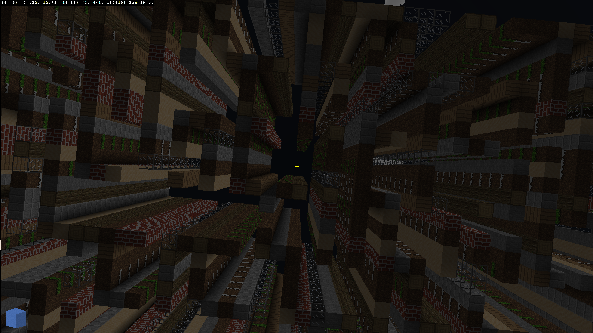

# Maze Builder

Build and download mazes interactively or using the command-line interface (CLI).
This project emphasizes conveniance and simplicity in order to design and export mazes to Wavefront object or ASCII formats.
The exports can then be integrated into game engines and renderers like Unity, Godot, and Blender.

[Check out the web app!](https://jade-semifreddo-f24ef0.netlify.app/)



## CMake

This project uses `cmake` to build and test the project. It uses `find_package` and `FetchContent` to get SDL and Catch2 if necessary. It requires modern hardware supporting pthreads and OpenGL 3.0. The SDL library is used for portability and providing a window to draw on, and Catch2 is used for the tests.

```sh
cmake -S ${my/mazebuilder/repo} -B build -DCMAKE_BUILD_TYPE=Release -DBUILD_MAZE_TESTS=1
```
```sh
cmake --build build/ -j 4
```
```sh
cd build && ctest --verbose
```

where `${my/mazebuilder/repo}` is the directory containg the Git repo for Maze Builder.

| CMake Option | Default | Description |
|--------------|---------|-------------
| BUILD_MAZE_TESTS | OFF | Build with maze algorithm testing via Catch2. |
| CMAKE_TOOLCHAIN_FILE | `cmake` | Building with a specific toolchain. Useful for Emscripten builds. |
| CMAKE_BUILD_TYPE | RelWithDebInfo | The build type is case-sensitive. It can determine compiler optimizations and performance. `MinSizeRel, Release, RelWithDebInfo, Debug`. |


Additionally, the Maze Builder can be built for the web using [Emscripten](https://emscripten.org/). Build with the toolchain file:

```sh
cmake -S . -B . -DCMAKE_TOOLCHAIN_FILE=${my/emsdk/repo}/upstream/emscripten/cmake/Modules/Platform/Emscripten.cmake 
```

Where `${my/emsdk/repo}` is the directory containing the Git repo for Emscripten.

Run a local server using the included [secure_http_server.py](secure_http_server.py) file.

## Commands and Help Message

```sh
Usages: maze_builder.exe [OPTION(S)]... [OUTPUT]
Generates mazes and exports to ASCII-format or Wavefront object format
Example: maze_builder.exe -w 10 -l 10 -a binary_tree > out_maze.txt
  -a, --algorithm    binary_tree [default], sidewinder
  -s, --seed         seed for the random number generator [mt19937]
  -w, --width        maze width [default=100]
  -y, --height       maze height [default=10]
  -l, --length       maze length [default=100]
  -i, --interactive  run program in interactive mode with a GUI
  -o, --output       stdout [default], plain text [.txt], or Wavefront object format [.obj]
  -h, --help         display this help message
  -v, --version      display program version
```

Specify a seed and a `binary tree` maze-generating algorithm:
```sh
./maze_builder --seed=1337 --algorithm=binary_tree -o bt.txt
```

Make Maze Builder run in an `interactive` mode:
```sh
./maze_builder -i
```

## Scripts

The `scripts` directory contains Ruby and Python scripts to build mazes quickly.
These programs can output to `.png` files or `stdout`. There is a Python script using Blender projects and the Blender API to generate a maze in that interface.

## Resources and Dependencies
 - [Mazes for Programmers Book](https://www.jamisbuck.org/mazes/)
 - [Craft](https://github.com/fogleman/Craft)
 - [Dear ImGui](https://github.com/ocornut/imgui)
 - [SDL](https://github.com/libsdl-org/SDL)
 - [Catch2](https://github.com/catchorg/Catch2)
 - [Emscripten](https://emscripten.org/)
