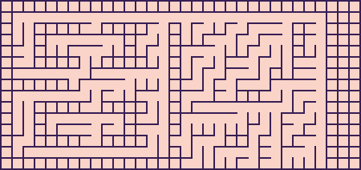
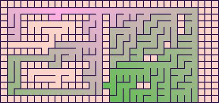
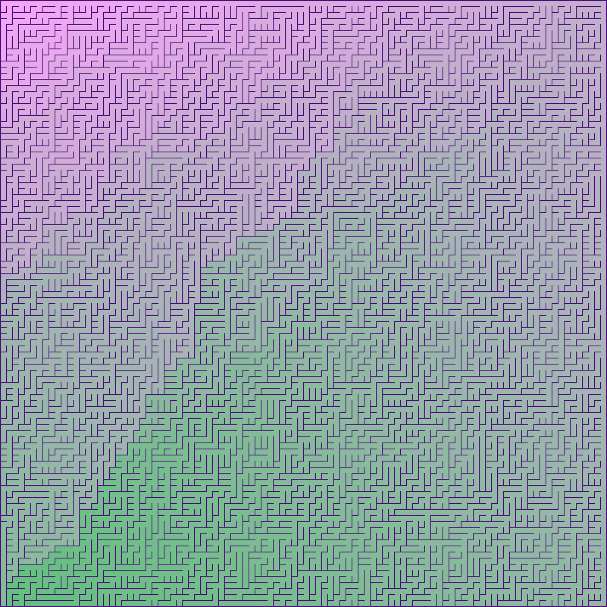

# Maze Builder

Maze Builder is a C++ maze generation library with a CLI and several example applications for desktop and web targets.

This repository contains:

- **Core library**: reusable maze data structures, generation algorithms, and output pipelines in `include/MazeBuilder`
- **Examples**: There's a CLI example, and an entire game built with SFML in `examples/Amazing`

## Quick start

Generate a 25x25 maze with depth-first algorithm and print to stdout:

```sh
mazebuildercli -r 25 -c 25 -a dfs -o stdout
```

Construct a maze in 3D and generate a Wavefront Object file:

```sh
mazebuildercli --rows=25 --columns=25 --seed=42 --algo=binary_tree --output=bt.obj
```

Write an image:

```sh
mazebuildercli -r 25 -c 25 -s 42 -a sidewinder -o 25x25.png
```

Ask for help:

```sh
mazebuildercli --help
```

Generate a masked maze:

```sh
mazebuildercli -m example_mask.txt -a binary_tree -o masked_maze.png
```

**Commands are case-sensitive.**

## What the library provides

The library is organized around a few core concepts:

- **`cell`**: an indexed maze cell with links to neighboring cells
- **`lab`**: helper operations for linking and unlinking cells
- **`grid` / `grid_interface`**: the main maze topology abstraction
- **`distance_grid` / `distances`**: distance and shortest-path annotation support
- **`mask` / `masked_grid`**: masked mazes driven by text files
- **`args` / `configurator`**: normalized CLI and JSON configuration handling
- **`runtime_app`**: the main application facade that parses input and produces output

## CLI capabilities

`examples/CLI/main.cpp` exposes these primary options:

| Option | Description |
|---|---|
| `-r`, `--rows` | Maze rows, clamped to `1..100` |
| `-c`, `--columns` | Maze columns, clamped to `1..100` |
| `-l`, `--levels` | Maze levels, clamped to `1..10` |
| `-s`, `--seed` | Random seed |
| `-a`, `--algo` | Maze algorithm: `binary_tree`, `sidewinder`, `dfs`, `prims` |
| `-d`, `--distances` | Show distances, optionally with slice notation like `[0:10]` |
| `-m`, `--mask` | Load a text mask file |
| `-j`, `--json` | Load arguments from JSON |
| `-o`, `--output` | Route output by target name or file extension |

### Output formats

The CLI and runtime can emit:

- plain text (`stdout` or `.txt`)
- JSON (`.json`)
- Wavefront object (`.obj`)
- raster images (`.png`, `.jpg`, `.jpeg`, `.bmp`)

Output routing is based on `--output`; file extensions select the renderer automatically.

### Text example

```text
+-----+-----+-----+-----+-----+-----+-----+-----+-----+-----+
|                 |                       |                 |
+-----+-----+     +     +-----+-----+     +     +     +     +
|                 |                 |     |     |     |     |
+     +-----+-----+     +-----+-----+     +     +     +-----+
|     |           |     |           |           |           |
+     +     +     +     +     +     +-----+     +-----+     +
|     |     |           |     |           |           |     |
+     +     +-----+-----+     +-----+     +-----+-----+     +
|           |           |     |           |                 |
+     +-----+     +     +-----+     +-----+     +-----+-----+
|     |           |           |     |                       |
+     +-----+-----+-----+     +     +-----+-----+-----+     +
|                       |     |     |                       |
+-----+-----+-----+     +     +     +     +-----+-----+     +
|                 |     |     |     |           |           |
+-----+-----+     +     +     +     +     +     +     +-----+
|                 |     |     |     |     |     |     |     |
+     +-----+-----+     +     +     +-----+     +     +     +
|                             |                 |           |
+-----+-----+-----+-----+-----+-----+-----+-----+-----+-----+
```

### Masked maze example

Masked mazes allow you to create mazes with specific shapes or patterns by using a text file where `X` represents blocked cells and any other character (typically `.` or space) represents available cells:

**Example mask file:**
```text
XXXXXXXXXXXXXXXXXXXXXXXXXXXXXXXX
X............................XXX
X..XXXX..XXXX..X..........X..XXX
X..X.......X...X..........X..XXX
X..X.......X...X..........X..XXX
X..XXXX..XXXX..X.............XXX
X..............X........X....XXX
XXXXXX.........X.............XXX
X..............X.....XX......XXX
X..XXXX..XXXX..X.............XXX
X..X.......X...X.............XXX
X..X.......X...X.............XXX
X..XXXX..XXXX.......XX.......XXX
X..............X.............XXX
XXXXXXXXXXXXXXXX.............XXX
```

**Generate a masked maze:**
```sh
mazebuildercli -m mask1.txt -o output.jpg --seed=1
```



**With distances:**
```sh
mazebuildercli -m mask1.txt -d[40:] -o output2.jpg --seed=1
```




## JSON input

The argument parser supports both object-style JSON and array-style JSON files.

Single-object JSON can describe one maze request:

```json
{
  "rows": 3,
  "columns": 5,
  "seed": 2,
  "algo": "dfs",
  "distances": true
}
```

Example usage:

```sh
mazebuildercli -j in.json -o 3x5_with_distances.json
```

Array-style JSON files can be used to store multiple configurations. This is covered by the parser tests in `tests/test_args_can_parse.cpp`.

```json
[
  { "rows": 10, "columns": 10, "algo": "dfs", "output": "maze1.txt" },
  { "rows": 20, "columns": 12, "algo": "sidewinder", "output": "maze2.txt" }
]
```

## C++ API

The simplest integration point is `mazes::runtime_app`, which accepts a command-like string and returns the generated artifact:

```cpp
#include <MazeBuilder/runtime_app.h>

std::string maze(const std::string& arguments) noexcept
{
    if (auto app = mazes::runtime_app::instance())
    {
        return std::string{app->apply(arguments)};
    }
    return {};
}
```

This same runtime facade is used by the CLI and example applications.

## Example applications

| Executable | Location | Purpose |
|---|---|---|
| `mazebuildercli` | `examples/CLI` | Command-line maze generation |
| `mazebuilderhttp` | `examples/Http` | Local HTTP server example |
| `amazing` | `examples/Amazing` | 2D visualization |

### HTTP example

The HTTP example runs a local server with a maze endpoint:

- `GET /mazes`
- `GET /mazes?rows=12&columns=10&algo=dfs`

See `examples/Http/README.md` for quick-start usage.

## Build and test

[CMake](https://cmake.org) is used for project configuration.

### CMake options

| CMake Option | Default | Description |
|--------------|---------|-------------|
| `MAZE_BUILDER_EXAMPLES` | `OFF` | Build the example applications |
| `MAZE_BUILDER_COVERAGE` | `OFF` | Enable coverage flags and add the `run_cppcheck` target |
| `MAZE_BUILDER_TESTS` | `OFF` | Build tests with `Catch2` |
| `MAZE_BUILDER_DOCS` | `OFF` | Build Doxygen documentation |
| `MAZE_BUILDER_MEMCHECK` | `OFF` | Enable `Valgrind` / `Memcheck` support |

### Build commands

Using presets with [Ninja](https://ninja-build.org/):

```sh
cmake ---preset ninja-examples
```

Build:

```sh
cmake --build build-ninja --config Release
```

By default, both a shared and static library are produced.

| Platform | static lib | shared lib |
| -------- | ---------- | ---------- |
| Windows | `mazebuildercore_static.lib` | `mazebuildercore_shared.dll` |
| Linux | `libmazebuildercore_static.a` | `libmazebuildercore_shared.so` |
| MacOS | `libmazebuildercore_static.a` | `libmazebuildercore_shared.dylib` |

### Testing

Configure for tests:

```sh
cmake -S . -B build-tests -DMAZE_BUILDER_TESTS:BOOL=ON
```

Run:

```sh
ctest --test-dir build-tests --verbose -C Debug
```

### Configure for the Web

Configure the examples for the Web with [Emscripten](https://emscripten.org/):

```sh
cmake -S . -B build-web -DCMAKE_TOOLCHAIN_FILE:FILEPATH=${EMSDK_ROOT}/upstream/emscripten/cmake/Modules/Platform/Emscripten.cmake
```

## Scripts

Scripts are documented in `scripts/README.md`, and mainly fall into these groups:

- **Asset conversion**: `from_png_to_bmp.py`, `invert_image_colors.py`
- **Local web serving**: `secure_http_server.py`
- **Make an icon**: `make_icon.rb`

`make_icon.rb` is especially useful as a compact reference implementation: it mirrors concepts such as cells, grids, distances, masked grids, and several maze algorithms.


## Screenshots




## Other Learning Resources

- [Mazes for Programmers Book](https://www.jamisbuck.org/mazes/)
- [codebox maze generator](https://codebox.net/pages/maze-generator/online)
