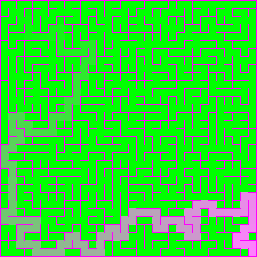

# Maze Builder

A text-processing tool that represents mazes as strings on multiple platforms and languages.

# Examples

The CLI lets you build mazes with configurable row, column, and a maze-generating algorithm.

```text
+-----+-----+-----+-----+-----+-----+-----+-----+-----+-----+
|                 |                       |                 |
+-----+-----+     +     +-----+-----+     +     +     +     +
|                 |                 |     |     |     |     |
+     +-----+-----+     +-----+-----+     +     +     +-----+
|     |           |     |           |           |           |
+     +     +     +     +     +     +-----+     +-----+     +
|     |     |           |     |           |           |     |
+     +     +-----+-----+     +-----+     +-----+-----+     +
|           |           |     |           |                 |
+     +-----+     +     +-----+     +-----+     +-----+-----+
|     |           |           |     |                       |
+     +-----+-----+-----+     +     +-----+-----+-----+     +
|                       |     |     |                       |
+-----+-----+-----+     +     +     +     +-----+-----+     +
|                 |     |     |     |           |           |
+-----+-----+     +     +     +     +     +     +     +-----+
|                 |     |     |     |     |     |     |     |
+     +-----+-----+     +     +     +-----+     +     +     +
|                             |                 |           |
+-----+-----+-----+-----+-----+-----+-----+-----+-----+-----+
```

Run the `binary_tree` algorithm with long arguments and put the results in [Wavefront Object format](https://en.wikipedia.org/wiki/Wavefront_.obj_file):
```sh
mazebuildercli.exe --rows=25 --columns=25 --seed=42 --algo=binary_tree --output=bt.obj
```

Run the `dfs` algorithm with short arguments:
```sh
mazebuildercli.exe -r 25 -c 25 -s 42 -a dfs -o 25x25.obj
```

Ask for help and print to standard output:
```sh
mazebuildercli.exe --help
```

**Commands are case-sensitive!**

### Data Formats

The library supports different export formats like Wavefront object format, JSON, and plain text or stdout.

Creating JSON output is easy:

`mazebuildercli.exe -r 2 -c 5 -o 2x5.json`

```json
{
  "rows": 3,
  "columns": 5,
  "seed": 2,
  "algo": "dfs",
  "distances": true,
  "output": "+---+---+---+---+---+\n
             | 0   1   2 | 9   A |\n
             +   +---+   +   +---+\n
             | 1   2 | 3 | 8   7 |\n
             +---+   +---+---+   +\n
             | 4   3   4   5   6 |\n
             +---+---+---+---+---+\n"
}
```

### C++ API

Interface with the C++ API in a modern C++ program:

```cpp
#include <iostream>
#include <MazeBuilder/runtime_app.h>

int main(void) {
  // Get the runtime instance / singleton
  if (auto app = mazes::singleton_base<mazes::runtime_app>::instance()) {

    std::cout << app->apply("--algo=binary_tree -r50 -c50 -s2") << std::endl;
  }
  return 0;
}
```

## Images and Media




Build on the Web in a 3D voxel world and download scenes.

[Check out the live Web app on itch.io!](https://flipsandale.itch.io/maze-builder)

## CMake Configuration and Testing

[CMake](https://cmake.org) is used for project configuration. Only [fmtlib](https://github.com/fmtlib/fmt) is required for the core lib, and [catch2](https://github.com/catchorg/Catch2) for tests, and the rest are dependencies for the examples.

Here are the external dependencies which can be grabbed from the Internet by CMake:

  - [box2d](https://box2d.org/documentation/hello.html)
  - [SDL](https://libsdl.org)
  - [SFML](https://sfml-dev.org)

Use the following CMake options to configure the project:

| CMake Option | Default | Description |
|--------------|---------|------------ |
| MAZE_BUILDER_EXAMPLES | OFF | Build with project examples enabled |
| MAZE_BUILDER_COVERAGE | OFF | Build with code coverage using `CppCheck` |
| MAZE_BUILDER_TESTS | OFF | Build with testing using `Catch2` |
| MAZE_BUILDER_DOCS | OFF | Build the docs using `doxygen` |
| MAZE_BUILDER_MEMCHECK | OFF | Build with `Valgrind` and `Memcheck` support |

### Build Commands

Configure with [Ninja](https://ninja-build.org/): `cmake -G"Ninja Multi-Config" -S . -B build-examples -DMAZE_BUILDER_EXAMPLES:BOOL=ON`

Build it: `cmake --build build-examples --config Release`

By default, both a shared-object library and static library are produced.
The shared and static files have different naming conventions depending on the platform:

| Platform | static lib | shared lib |
| -------- | ---- | ---- |
| Windows | `mazebuildercore_static.lib` | `mazebuildercore_shared.dll` |
| Linux | `libmazebuildercore_static.a` | `libmazebuildercore_shared.so` |
| MacOS | `libmazebuildercore_static.a` | `libmazebuildercore_shared.dylib` |

### Testing

Configure the project for testing:
`cmake -S . -B build-tests -DMAZE_BUILDER_TESTS:BOOL=ON`

Run the tests: `ctest --test-dir build-tests/tests --verbose -C Debug`

### Configure for the Web

Configure the examples for the Web using [Emscripten](https://emscripten.org/) and their toolchain file (or `emcmake`).

```sh
cmake -S . -B build-web -DCMAKE_TOOLCHAIN_FILE:FILEPATH=${EMSDK_ROOT}/upstream/emscripten/cmake/Modules/Platform/Emscripten.cmake
```

## Scripts

See [README Scripts](scripts/README.md)

## Helpful Resources on Mazes

 - [Mazes for Programmers Book](https://www.jamisbuck.org/mazes/)
 - [codebox maze generator](https://codebox.net/pages/maze-generator/online)
